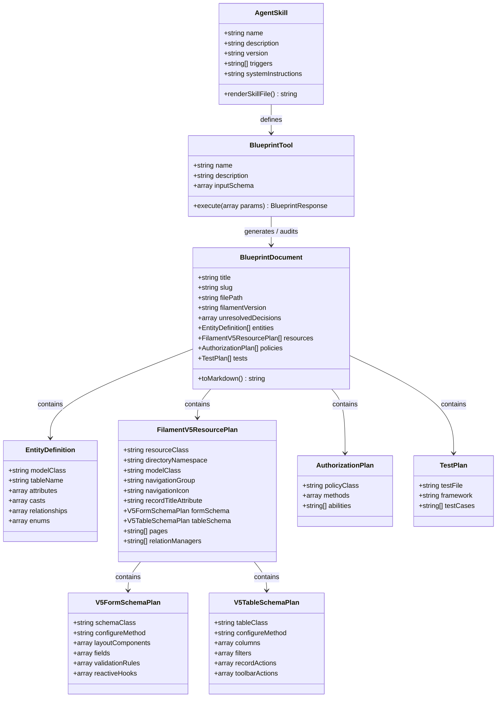

# Data Model: Filament v5.x Blueprint Agent Skill (Fila-boost)

## Core Domain Entities & Filament v5.x Mapping

---

## Entity Specifications

### 1. AgentSkill (`SKILL.md`)
Represents the self-contained Agent Skill module exposed to Boost and coding agents.
- **Attributes**:
  - `name`: String identifier (`planning-filament`, `reviewing-filament-plans`).
  - `description`: Summary of trigger conditions for the agent.
  - `version`: SemVer string (`1.0.0`).
  - `triggers`: Keywords (`["filament blueprint", "plan filament", "filament resource", "filament v5"]`).
  - `system_instructions`: Declarative prompt guidelines detailing Filament v5 conventions (modular directory structure, `Schemas/`, `Tables/`, `configure()` pattern, strict validation, safe policies).

### 2. BlueprintDocument (`blueprints/{feature}.md`)
Represents the complete markdown artifact generated by the planning agent.
- **Attributes**:
  - `title`: Human-readable name of the feature (e.g., `Customer Invoicing`).
  - `slug`: kebab-case filename key (e.g., `customer-invoicing`).
  - `file_path`: Target path in project checkout (default: `blueprints/{slug}.md`).
  - `filament_version`: Target version (`5.x`).
  - `unresolved_decisions`: Array of flagged business decisions.
  - `entities`: Array of `EntityDefinition`.
  - `resources`: Array of `FilamentV5ResourcePlan`.
  - `policies`: Array of `AuthorizationPlan`.
  - `tests`: Array of `TestPlan`.

### 3. FilamentV5ResourcePlan
Specifies the Filament v5 Resource and associated modular sub-classes.
- **Attributes**:
  - `resource_class`: Fully qualified class name (`App\Filament\Resources\Customers\CustomerResource`).
  - `directory_namespace`: `App\Filament\Resources\Customers`.
  - `model_class`: Fully qualified model name (`App\Models\Customer`).
  - `record_title_attribute`: String (`name`).
  - `navigation_group`: Cluster or navigation grouping (`Sales`).
  - `navigation_icon`: Heroicon identifier (`heroicon-o-users`).
  - `form_schema`: Embedded `V5FormSchemaPlan` referencing `App\Filament\Resources\Customers\Schemas\CustomerForm`.
  - `table_schema`: Embedded `V5TableSchemaPlan` referencing `App\Filament\Resources\Customers\Tables\CustomersTable`.
  - `pages`: List of resource pages (`ListCustomers`, `CreateCustomer`, `EditCustomer`, `ViewCustomer`).
  - `relation_managers`: Embedded relation managers for child relationships.

### 4. V5FormSchemaPlan
Specifies the modular form schema class in Filament v5.
- **Attributes**:
  - `schema_class`: Fully qualified class name (`App\Filament\Resources\Customers\Schemas\CustomerForm`).
  - `configure_method`: `configure(Filament\Schemas\Schema $schema): Filament\Schemas\Schema`.
  - `layout_components`: Layout wrappers (`Section`, `Grid`, `Tabs`).
  - `fields`: Field components (`TextInput`, `Select`, `DatePicker`, `FileUpload`, `Repeater`).
  - `validation_rules`: Declarative Laravel validation constraints.
  - `reactive_hooks`: Livewire reactive hooks (`live()`, `afterStateUpdated()`).

### 5. V5TableSchemaPlan
Specifies the modular table schema class in Filament v5.
- **Attributes**:
  - `table_class`: Fully qualified class name (`App\Filament\Resources\Customers\Tables\CustomersTable`).
  - `configure_method`: `configure(Filament\Tables\Table $table): Filament\Tables\Table`.
  - `columns`: Column components (`TextColumn`, `IconColumn`, `ImageColumn`).
  - `filters`: Table filters (`Filter`, `SelectFilter`, `TernaryFilter`).
  - `record_actions`: Individual row actions (`EditAction`, `DeleteAction`).
  - `toolbar_actions`: Table-level and bulk actions (`BulkActionGroup`, `DeleteBulkAction`).
