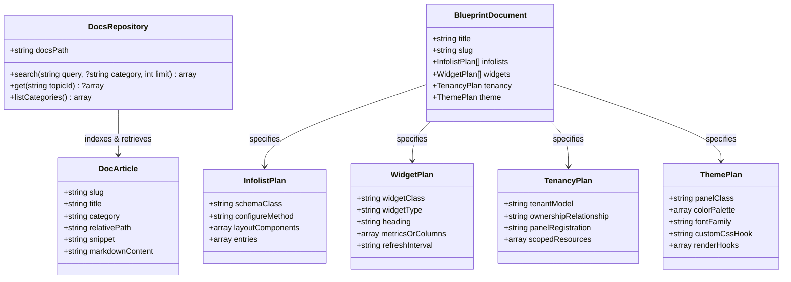

# Data Model: Full Filament Feature Coverage & Documentation MCP Tooling

## Domain Entities & Relationships

---

## Entity Specifications

### 1. DocArticle
Represents a bundled markdown documentation article.
- **Attributes**:
  - `slug`: Unique identifier / relative key (e.g., `12-components/02-infolist` or `08-styling/03-colors`).
  - `title`: Extracted H1 title (e.g., `Infolist Component`, `Colors & Theming`).
  - `category`: Top-level folder category (e.g., `components`, `styling`, `resources`, `advanced`).
  - `relative_path`: Path from package root (`docs/12-components/02-infolist.md`).
  - `snippet`: Extracted summary or introductory text (first 250 characters).
  - `markdown_content`: Full markdown body.

### 2. InfolistPlan
Represents the modular Infolist schema for viewing records in Filament v5.
- **Attributes**:
  - `schema_class`: FQCN (e.g., `App\Filament\Resources\Orders\Infolists\OrderInfolist`).
  - `configure_method`: `configure(Infolist $infolist): Infolist`.
  - `layout_components`: `Section`, `Grid`, `Tabs`, `Split`.
  - `entries`: `TextEntry`, `IconEntry`, `ImageEntry`, `RepeatableEntry`.

### 3. WidgetPlan
Represents a Filament widget component.
- **Attributes**:
  - `widget_class`: FQCN (e.g., `App\Filament\Widgets\OrderStatsOverviewWidget`).
  - `widget_type`: `stats_overview`, `chart`, `table`.
  - `heading`: Title displayed on the widget.
  - `metrics_or_columns`: Definition of stat cards, chart datasets, or table columns.
  - `refresh_interval`: Optional polling interval (e.g., `'15s'`).

### 4. TenancyPlan
Represents multi-tenant architecture configuration.
- **Attributes**:
  - `tenant_model`: FQCN of the tenant entity (e.g., `App\Models\Team` or `App\Models\Company`).
  - `ownership_relationship`: BelongsTo relationship on scoped models (`team()`).
  - `panel_registration`: Code hook for PanelProvider (`->tenant(Team::class)`).
  - `scoped_resources`: List of resources enforcing tenant ownership.

### 5. ThemePlan
Represents visual theming and UI layout customization.
- **Attributes**:
  - `panel_class`: FQCN of the PanelProvider (e.g., `App\Providers\Filament\AdminPanelProvider`).
  - `color_palette`: Associative array of colors (`primary`, `success`, `warning`, `danger`, `gray`, `info`).
  - `font_family`: Google Font or custom typography (`Inter`, `Fira Code`).
  - `render_hooks`: List of render hooks registered (e.g., `PanelsRenderHook::USER_MENU_BEFORE`).
